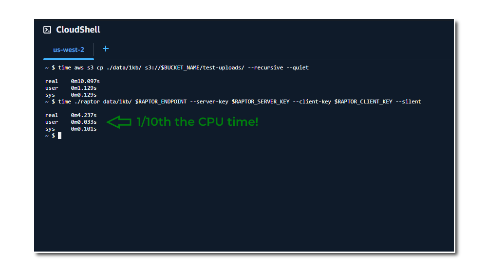

# Raptor: Fast Small File Transfers to S3



This dependendcy-free native executable and serverless backend delivers **small files** to S3 fast. Much faster than the S3 CLI. Perhaps most importantly, it does so using a tiny fraction of the CPU time, saving energy and keeping our datacenters (and planet) a little cooler.

## Background

Moving small files to S3 is slow, and largely remains so. AWS has done significant work to improve S3 throughput, including the [Common Runtime (CRT) transfer client](https://github.com/awslabs/aws-c-s3) and [CLI transfer configuration](https://docs.aws.amazon.com/cli/latest/topic/s3-config.html#preferred-transfer-client). But these optimizations only go so far. S3's API is based on HTTPS, and the [expected floor for small object latency is ~100-200 ms per request](https://docs.aws.amazon.com/AmazonS3/latest/userguide/optimizing-performance.html). For small files (less than ~10 KB) the TLS protocol overhead is substantial; for very small files (~1 KB) it dominates the overall transfer time and compute.

This project (raptor) doesn't use HTTP, TLS or TCP. Instead, files are transferred to S3 over UDP using RaptorQ encoding and optionally protected by WireGuard's encryption.

RaptorQ is defined in [RFC 6330](https://datatracker.ietf.org/doc/html/rfc6330) and is a "fountain code" for encoding objects into "symbols" ( chunks) in a way that allows reliable reconstruction over lossy connections. Any sufficiently-large subset of received encoded symbols (regardless of which ones arrive, or in what order) can be used to reconstruct the original object. This makes it well-suited for high-throughput, fire-and-forget file delivery over UDP.

In this repo you'll find a complete implemention of a "RaptorQ over UDP to S3" file transfer system:

- The `raptor` **CLI tool** encodes a local file and sends it to the decoder endpoint.
- A **decoder backend** on AWS (SQS + Lambda + DynamoDB + S3) reassembles objects from incoming encoded packets delivered via Proxylity UDP Gateway.
- A **shared C# library** implementing the RaptorQ encoder/decoder (GF(256) arithmetic, intermediate symbol generation, constraint matrix, Gaussian elimination).

The CLI implementation targets **C# / .NET 10** with AoT for a small single file native executable. 

The backend infrastructure is serverless and defined in `template.json` (AWS SAM / CloudFormation). Lambda functions are also AoT compiled, native executables to minimize cold start and maximize performance. WireGuard termination, packet batching and response routing are provided by [Proxylity UDP Gateway](https://proxylity.com).

## Architecture


> **NOTE:** This examples uses DDB for keeping track of packets in flight, and that *can be* expensive (it isn't for light to moderate use). Using this stack only for small files is recommened. If you'd like to use this approach for very high volumes of files, check out the options for reducing costs discussed in the [cost analysis](docs/cost-analysis.md).

## Significant IaC Resources

| Resource | Purpose |
|---|---|
| `DecoderListener` | Receives encoded UDP packets from the CLI or encoder Lambda |
| `DecoderListener` Destination | Routes batches of JSON encoded packets to `IngestionQueue` |
| `IngestionQueue` | Standard SQS Queue buffers packets to be received by `PacketIngestorLambda` |
| `PacketIngestorLambda` | Stores received symbols in DynamoDB; Triggers `BlockCompleterLambda` when enough packets arrive |
| `CompletionQueue` | FIFO SQS queue that groups by `objectId` and deduplicates on `{objectId}_{blockId}` so blocks are completed at most once | 
| `BlockCompleterLambda` | Reads block packet data from DDB and decodes them, reassembles file from blocks as S3 object multipart upload | 
| `InFlightTable` | Three item types per transfer: `METADATA/OVERALL` (multipart upload ID, completion counter), `COUNT/BLOCK` (per-block received-packet counter), and `PACKET` (individual encoded symbols); 4-hour TTL. |
| `ReceivedObjectsBucket` | Stores reassembled objects; 28-day lifecycle expiry. Created by the stack unless provided as a parameter. |
| `RoleForProxylity` | Allows Proxylity to deliver packets to the ingestion queue; principal and trust configuration loaded from the Proxylity config object in S3 |
| `EncoderLambda` | Reads a file from S3, encodes it, and sends packets to a specified UDP endpoint. Useful for testing and to copy small files between buckets |

The CloudFormation template [`template.json`](./template.json) also includes the scaffolding roles and other "wiring" resources. 

## Packet Wire Format

Each UDP datagram carries one encoded symbol using the RFC 6330 OTI layout, with non-RFC pipeline fields appended:

```
[ 1 byte  ] id_length              — byte length of the UTF-8 object ID
[ N bytes ] object_id              — UTF-8 string (N = id_length); relative file path with optional prefix

Common FEC OTI (RFC 6330 §8.1, 8 bytes, big-endian):
  [ 5 bytes ] F (transfer_length)  — total object size in bytes (unsigned 40-bit)
  [ 1 byte  ] reserved = 0
  [ 2 bytes ] T (symbol_size)       — symbol size in bytes (unsigned 16-bit)

Scheme-specific FEC OTI (RFC 6330 §8.2, 4 bytes):
  [ 1 byte  ] Z (num_source_blocks) — total source blocks, 1..255
  [ 2 bytes ] N (sub-blocks)        — always 1
  [ 1 byte  ] Al (alignment)        — always 4

FEC Payload ID (RFC 6330 §8.3, 4 bytes, big-endian):
  [ 1 byte  ] SBN (source_block_number) — zero-based block index (0..Z-1)
  [ 3 bytes ] ESI (encoding_symbol_id)  — symbol index within the block

[ * bytes ] symbol_data       — the encoded symbol payload
```

The fixed portion of the header (`id_length` + OTI fields + FEC Payload ID) is **17 bytes**; the object ID (`id_length` bytes of UTF-8) is variable. The object ID is the relative file path with an optional timestamp prefix (e.g. `20260501120000/path/to/file.zip`). Max packet size is 1400 bytes, so the available symbol payload is `1400 − 17 − len(object_id)` bytes. The CLI enforces a maximum object ID length and chooses a symbol size between `MIN_SYMBOL_SIZE` (256) and `MAX_SYMBOL_SIZE` (1280) bytes by selecting the smallest power-of-2 source symbol count K that keeps each symbol within that range.

Files larger than `MAX_BLOCK_BYTES` (512 KB) are split into multiple **source blocks**, each encoded and decoded independently. The SBN field is 1 byte, so up to 255 blocks are supported — a maximum file size of **~127 MB**. Each block has K = `MAX_BLOCK_BYTES / symbol_size` ≈ 512 source symbols. Single-block transfers (`num_blocks = 1`, `block_index = 0`) are backward-compatible with simple decoders that ignore the block fields.

## DynamoDB Schema

**Table key structure:** `PK` (string) + `SK` (string), single table. Three item types per transfer:

### Overall metadata item

This record is created once per `objectId` by the first Lambda to process any packet. Holds the S3 multipart upload ID shared by all per-block decode Lambdas.

| Attribute | Type | Description |
|---|---|---|
| `PK` | S | `METADATA\|{ObjectId}` |
| `SK` | S | `OVERALL` |
| `NumBlocks` | N | Total number of source blocks in this transfer |
| `TotalOriginalSize` | N | Total file size in bytes |
| `CompletedBlocks` | N | Atomic counter — how many blocks have been decoded and uploaded |
| `S3UploadId` | S | The S3 multipart upload ID; created by the first-writing Lambda, re-used by all others |
| `IsFinalized` | BOOL | Set to `true` by the one Lambda that wins the `CompleteMultipartUpload` race; prevents duplicate finalizations |
| `Expires` | N | Unix epoch TTL (4 hours from first packet) |

### Block packet count item

One item per source block. Tracks how many symbols have been received for the block; triggers block decode once the count reaches K. Per-block decode parameters (K, SymbolSize, NumBlocks, etc.) are carried in the `CompletionQueue` message payload rather than stored here.

| Attribute | Type | Description |
|---|---|---|
| `PK` | S | `COUNT\|{ObjectId}` |
| `SK` | S | `BLOCK\|{BlockIndex:D6}` (zero-padded for lexicographic order) |
| `BlockIndex` | N | Zero-based block index |
| `ReceivedPackets` | N | Atomic counter incremented as batches of symbols arrive for this block |
| `Expires` | N | Unix epoch TTL (4 hours from first packet) |

### Packet item

One item per received symbol. The PK fans out across 6 sub-partitions (`a`–`f`) keyed by `PacketIndex % 6`, preventing hot-partition throttling when many symbols for a single block arrive concurrently.

| Attribute | Type | Description |
|---|---|---|
| `PK` | S | `PACKET\|{ObjectId}\|{BlockIndex:D6}\|{a-f}` (sub-partition suffix = `'a' + PacketIndex % 6`) |
| `SK` | S | `{PacketIndex:D10}` (zero-padded for ordering) |
| `ObjectId` | S | GUID string |
| `BlockIndex` | N | Source block index |
| `PacketIndex` | N | Symbol index within the block |
| `Data` | S | Base64-encoded symbol bytes |
| `Timestamp` | N | Unix epoch seconds at write time |
| `Expires` | N | Unix epoch TTL (4 hours from first packet) |


## SQS Message Formats

### IngestionQueue message

Delivered by the Proxylity UDP Gateway. Each SQS record body is a JSON object wrapping one raw UDP datagram:

```json
{
  "Data": "<base64-encoded raw UDP datagram>",
  "IngressRegion": "<AWS region where the packet arrived>",
  "Remote": {
    "IpAddress": "<sender IP address>",
    "Port": <sender UDP port>,
    "PeerKey": "<WireGuard public key of the sender peer>"
  }
}
```

`Data` contains the full wire-format datagram described in the Packet Wire Format section above. Proxylity batches up to 10 datagrams per SQS message delivery (`Batching.Count = 10`, `TimeoutInSeconds = 0.05`).

### CompletionQueue message (FIFO)

Sent by `PacketIngestorLambda` once a block reaches at least K received symbols. The message body is a JSON-serialized `BlockCompleterPayload` carrying all decode parameters so `BlockCompleterLambda` can start work without an extra DDB lookup:

```json
{
  "ObjectId": "<transfer GUID>",
  "BlockIndex": <zero-based block index>,
  "K": <source symbol count for this block>,
  "SymbolSize": <bytes per symbol>,
  "NumBlocks": <total source blocks in the transfer>,
  "OriginalSize": <total file size in bytes>,
  "BlockDataSize": <actual data bytes in this block, excluding symbol zero-padding>,
  "EgressRegion": "<AWS region used for reply routing>",
  "RemoteEp": "<ip>:<port> of the originating sender",
  "PeerKey": "<WireGuard public key of the originating peer>"
}
```

FIFO routing attributes set by the ingestor:

| Attribute | Value | Purpose |
|---|---|---|
| `MessageGroupId` | `"{ObjectId}_{BlockIndex}"` | One group per block; ensures sequential processing within a block |
| `MessageDeduplicationId` | `"{BlockIndex}"` | Deduplicated within the message group (`DeduplicationScope = messageGroup`), preventing duplicate decode triggers per block |

## CLI Tool — `src/raptor-cli`

A .NET console app targeting .Net 10 with native AoT compilation that:
- Accepts a file/folder path and a UDP endpoint URI (`udp://host:port`) as arguments
- Reads and encodes files using the shared `RaptorQEncoder` from `raptorq-lib`
- Sends encoded symbols as UDP packets to the endpoint
- Holds a steady send rate/bandwidth (defaults to 10 Mbps)
- Waits for block confirmation (ACK) packets to verify each has been received

```bash
raptor foo.zip udp://ingress-1.proxylity.com:12345
```

## Shared Library — `src/raptorq-lib`

A shared library targeting .Net 10 and implementing RaptorQ encoding and decoding per [RFC 6330](https://datatracker.ietf.org/doc/html/rfc6330).

## Building the CLI app

For best performance, publish the CLI project as a release build which will generate a small, depenendency free native executable:

```bash
# from the repo root folder 
dotnet publish -o ./publish -c Release ./src/raptor-cli/raptor-cli.csproj
```

The executable will be located in the `publish` subfolder.

## Deploying the Backend Service

The CLI depends on a decoder endpoint provisioned in your AWS account. The backend provides the decoding of the Raptor-Q symbols back into files, and putting them to your S3 bucket. All of that happens in your own account, under your control.  If you have an existing bucket provide the ARN for it (including the prefix where you'd like the objects/files to appear).  If no bucket is specified the stack will automatically create one for you.

> **Prerequisites:** `aws` CLI, `sam` CLI, and `.NET 10 SDK` installed and configured. Must be subscribed to [Proxylity UDP Gateway](https://aws.amazon.com/marketplace/pp/prodview-cpvl5wgt2yo2e) for the AWS account (free tier is available).

The stack name must be **lowercase** — it is used as part of the S3 bucket name (`{stack}-objects-{accountId}`) when one is automatically created.

```bash
sam build && sam deploy --guided
```

To tear down the stack:

```bash
sam delete
```

## Testing

```bash
# Get the listener endpoint and bucket name from stack outputs (update stack name if needed)
ENDPOINT=$(aws cloudformation describe-stacks --stack-name raptorq \
  --query "Stacks[0].Outputs[?OutputKey=='DecoderListenerPort'].OutputValue" --output text)
HOST=$(aws cloudformation describe-stacks --stack-name raptorq \
  --query "Stacks[0].Outputs[?OutputKey=='DecoderListenerHost'].OutputValue" --output text)

# Send a file to the backend
raptor foo.zip udp://${HOST}:${ENDPOINT}

# List reassembled objects in S3
BUCKET=$(aws cloudformation describe-stacks --stack-name raptorq \
  --query "Stacks[0].Outputs[?OutputKey=='BucketName'].OutputValue" --output text)

aws s3 ls s3://${BUCKET} --recursive

# Compare transfer time: RaptorQ UDP vs direct S3 upload
time raptor foo.zip udp://${HOST}:${ENDPOINT}
time aws s3 cp foo.zip s3://${BUCKET}
```

# CLI Usage

```
Usage:
 raptor <file> <udp|wg>://<ip>:<port> [options]

   <file>                   Path to the local file or folder to send.
   [udp|wg]://<ip>:<port>   Backend endpoint (UDP or WireGuard).
   --server-key <base64>    WireGuard public key of the server (required for wg://).
   --client-key <base64>    WireGuard private key of the client (required for wg://).
   --recursive              If <file> is a folder, include all subfolders (default: false).
   --overhead <number>      Fraction of repair symbols above K (default: 0.05 = 5%).
   --rate-mbps <number>     Max send rate in Mbps (default: 10).
   --block-timeout <number> Seconds to wait for a block confirmation before retrying 
                            (default: 2, 0 = disabled).
   --confirm <flags>        Wait for confirmations from backend 
                            [NONE, ANY = PACKETS | BLOCK | FILE, PACKETS, BLOCK, FILE] 
                            (default: ANY).
   --verbose                Print detailed encoding and progress information.
   --silent                 Suppress all output except usage errors.
   --no-prefix              Don't prefix object IDs with timestamps; use relative paths only.

 Examples:
   raptor myfile.zip udp://203.0.113.42:2048 --overhead 0.10 --rate-mbps 10
   raptor myfile.zip udp://203.0.113.42:2048 --block-timeout 5
   raptor myFolder wg://203.0.113.42:2048 --server-key <base64> \
     --client-key <base64> --recursive --verbose
```

# License

This project is released under the [MIT License](LICENSE). You are free to use, modify, and distribute it in both commercial and non-commercial projects.
